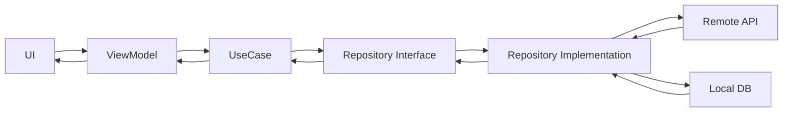

# KotlinTestApp2024

A sample Android application built with **Kotlin**, demonstrating **Clean Architecture**, **MVVM**, and **Jetpack Compose**.  
This app loads images (e.g., from TheCatAPI), caches them locally, supports offline mode, and displays detail views with animations.

---

## 📖 Table of Contents

- [Overview](#overview)  
- [Features](#features)  
- [Architecture & Layers](#architecture--layers)  
- [Tech Stack](#tech-stack)  
- [Setup & Installation](#setup--installation)  
- [Usage](#usage)  
- [Testing](#testing)  

---

## 🧱 Overview

**KotlinTestApp2024** is a learning-oriented Android app template. It demonstrates how to structure a project with **Clean Architecture** and **MVVM**, leveraging modern Android libraries such as Hilt, Room, Retrofit, and Coil.  
The goal is to showcase best practices for scalability, maintainability, and offline-first capability.

---

## ✨ Features

- Fetch and display image lists from an API  
- Infinite scroll (“load more”) when reaching list end  
- Shimmer or placeholder effect while images load  
- Caching images and data in Room database  
- Offline mode: display cached data when no network  
- Detail view for each image with animated transitions  
- Drag-to-close gesture in detail view  
- Unit and integration tests  

---

## 🏗 Architecture & Layers

This project follows **Clean Architecture**, separating concerns into three layers:

| Layer | Description |
|--------|-------------|
| **Domain** | Contains core business logic, entities, and UseCases |
| **Data** | Implements repositories, manages remote (API) and local (Room) data sources |
| **Presentation** | UI layer built with Jetpack Compose and ViewModels managing reactive states |

### 📊 Data Flow Diagram



---

## 🛠 Tech Stack

| Concern | Library / Tool |
|----------|----------------|
| Language | Kotlin |
| UI | Jetpack Compose, Material3 |
| DI | Hilt (Dagger) |
| Networking | Retrofit, OkHttp |
| Local Storage | Room |
| Image Loading | Coil |
| Async | Coroutines, Flow |
| Navigation | Navigation Compose |
| Testing | JUnit, Espresso, Compose UI Test |

---

## ⚙️ Setup & Installation

### 1️⃣ Clone the Repository
```bash
git clone https://github.com/duongpill/KotlinTestApp2024.git
cd KotlinTestApp2024
```

### 2️⃣ Configure API Key (if required)
If using an external API (like TheCatAPI), add your API key to:
```
local.properties
```
```properties
CAT_API_KEY=your_api_key_here
```

### 3️⃣ Build and Run
Open the project in Android Studio, then run:
```bash
./gradlew assembleDebug
```
or simply click ▶️ **Run** inside Android Studio.

---

## ▶️ Usage

- Launch the app to view an image list loaded from the API  
- Scroll to load more images automatically  
- Tap any image to view details with animation  
- Drag down to close the detail screen  
- When offline, previously loaded images are displayed from cache  

---

## 🧪 Testing

- **Unit Tests** for UseCases and domain logic  
- **Integration / UI Tests** for verifying user flows and state management  

---

Example flow:
```
🏠 Home Screen → Scroll → Tap Image → Detail Animation → Drag Down to Close
```

---

*Thank you for checking out KotlinTestApp2024! Happy coding! 🚀*
